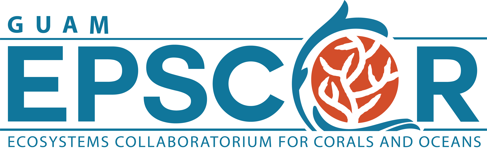

# EPSCoR GECCO: Team Coral Reefsearchers

  ## Description
  Our research project, under the Guam EPSCoR GECCO program, is focused on the modeling of coral reef dynamics and application of game theory in order to determine the effects of overfishing on Guam's coral reef ecosystem in the coming decades. By using compartment models and differential equations, we are able to model the dynamics of coral reef ecosystems in response to the overfishing of parrotfish (_Scarus Altipinnis_), and by applying game theory, we are able to assess the dominant strategy in terms of education to better protect coral reefs and their ecosystem.

  ## Team Members
  * Aaron Bumagat
  * Michelle Luces
  * Henry Song

  ## Acknowledgements
  Support for the Young Scholars Research Experience in Mathematics (YSREM)  is through the MAA Tensor SUMMA Program. Support for the MAA National Research Experience for Undergraduates Program (NREUP) is provided by the National Science Foundation (Grant Number DMS-1950644). Support for the NSF EPSCoR project, Guam Ecosystems Collaboratorium for Corals and Oceans (GECCO) is provided by the National Science Foundation (Grant Number DMS-1946352).

  Special thanks to Dr. Bastian Bentlage, our faculty mentors (Dr. JaeYong Choi, Dr. HyunJu Oh, & Dr. Leslie Aquino), and our Research Assistants (Jaron Bautista & Regina-Mae Dominguez).

[//]: <> (GECCO Logo)

  

